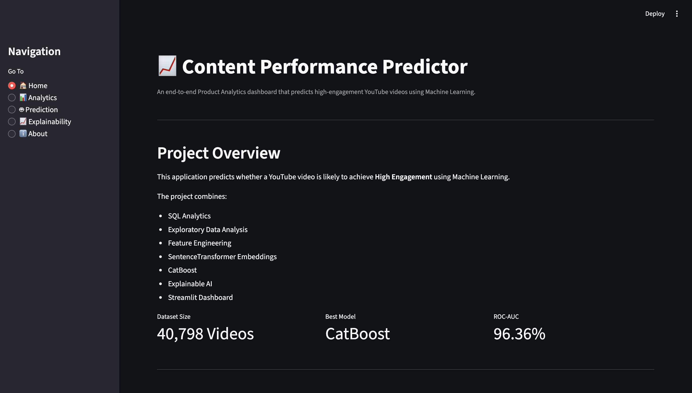
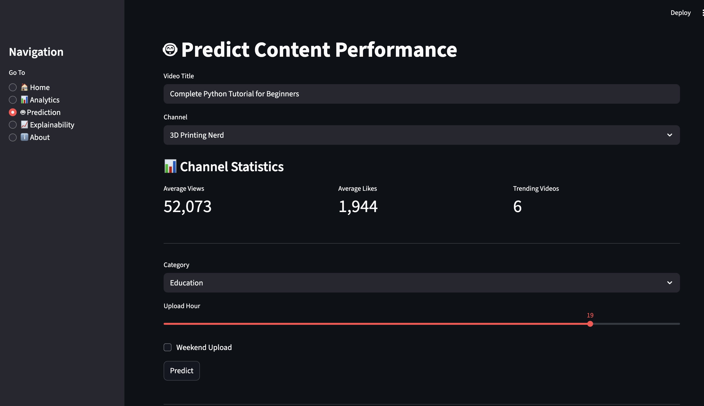
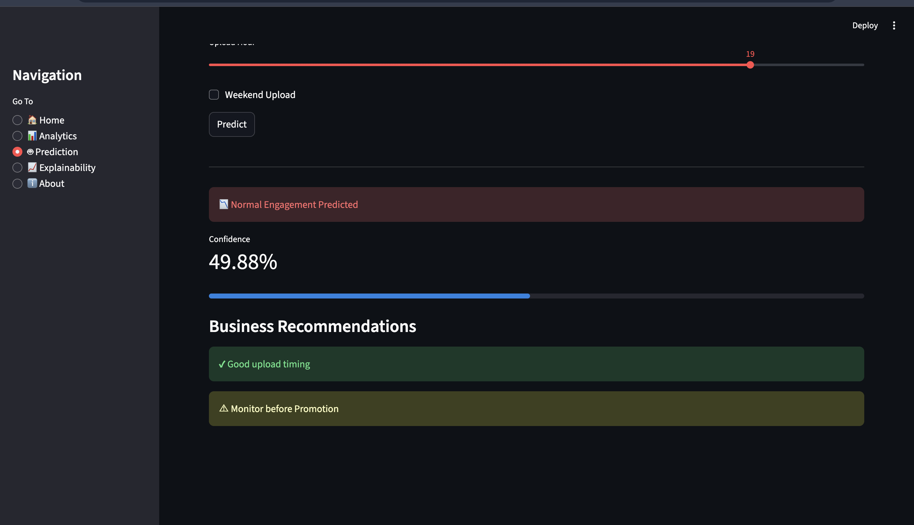
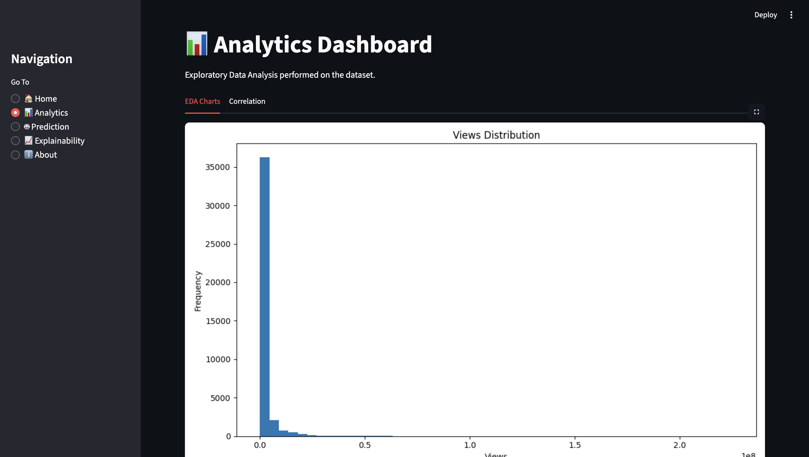
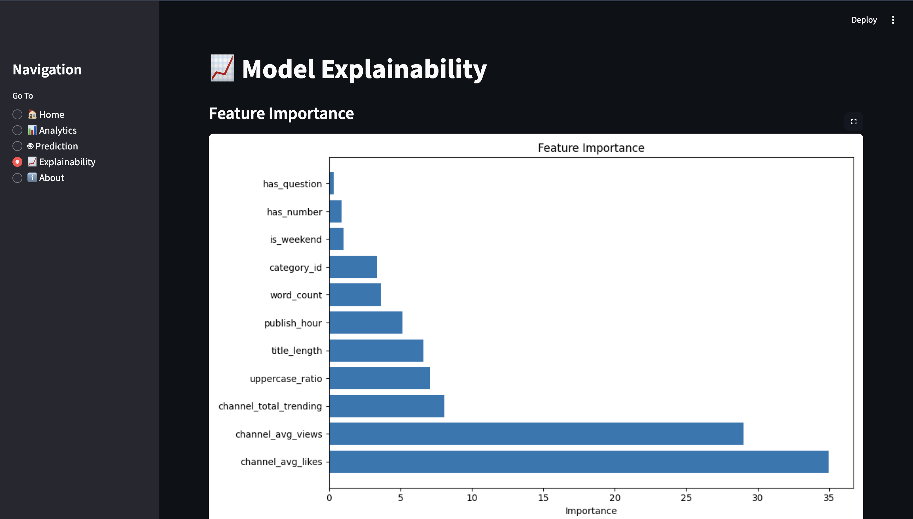
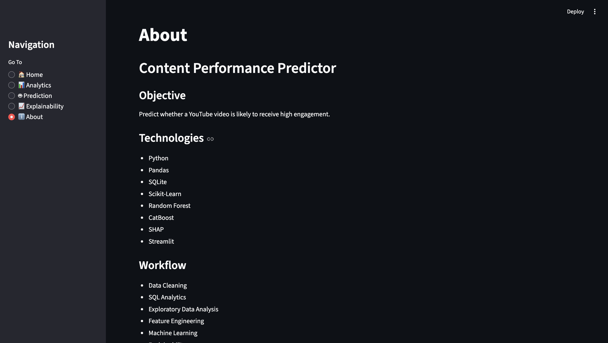

<div align="center">

# 📈 Content Performance Predictor

### Predict YouTube Video Engagement Before Publishing using Machine Learning

Semantic NLP • CatBoost • Explainable AI • Streamlit Dashboard

<p align="center">


</p>

<p align="center">

<a href="#-application-preview">📸 Preview</a> •
<a href="#-features">✨ Features</a> •
<a href="#-project-pipeline">🏗️ Pipeline</a> •
<a href="#-model-performance">📊 Performance</a> •
<a href="#-installation">⚙️ Installation</a>

</p>

</div>

---

# 🚀 Business Problem

Every day thousands of videos are uploaded to YouTube, but creators often have no reliable way to estimate how well a video will perform before publishing.

This project predicts whether a video is likely to achieve **High Engagement** by learning patterns from historical YouTube trending data. It combines semantic understanding of titles with channel-level statistics to provide predictions, confidence scores, and actionable business recommendations.

---

# ✨ Features

- 🎯 Predict High Engagement before publishing
- 🧠 SentenceTransformer title embeddings
- 🤖 CatBoost classifier
- 📊 Interactive analytics dashboard
- 📈 SHAP explainability
- 📅 Upload timing analysis
- 📺 Channel performance statistics
- 💡 Business recommendations
- 🌙 Modern Streamlit interface

---

# 📸 Application Preview

## 🏠 Home



---

## 🔮 Prediction Interface

Configure the title, channel, upload timing, and category before publishing.



---

## 📈 Prediction Result

The application predicts engagement probability and generates recommendations.



---

## 📊 Analytics Dashboard

Explore channel statistics, engagement trends, and dataset insights.



---

## 🧠 Explainability

Understand why the model made a prediction using SHAP feature importance.



---

## ℹ️ About

Project overview, dataset statistics, and evaluation metrics.



---

# 🏗️ Project Pipeline

```text
YouTube Trending Dataset
            │
            ▼
     Data Cleaning
            │
            ▼
 Feature Engineering
            │
            ▼
SentenceTransformer
(all-MiniLM-L6-v2)
            │
            ▼
384-Dimensional Embeddings
            │
            ▼
Metadata Features
• Publish Hour
• Category
• Channel Statistics
• Weekend Upload
            │
            ▼
CatBoost Classifier
            │
            ▼
High Engagement Prediction
```

---

# 📊 Model Performance

| Metric | Score |
|---------|------:|
| Accuracy | **93.88%** |
| Precision | **93.95%** |
| Recall | **74.20%** |
| F1 Score | **82.92%** |
| ROC-AUC | **96.36%** |

---

# 🛠️ Tech Stack

| Category | Technologies |
|-----------|--------------|
| Language | Python |
| Machine Learning | CatBoost |
| NLP | SentenceTransformers |
| Explainability | SHAP |
| Dashboard | Streamlit |
| Data Analysis | Pandas, NumPy |
| Visualization | Plotly, Matplotlib |
| ML Utilities | Scikit-learn |

---

# 📂 Project Structure

```text
Content_Performance_Predictor/
│
├── app.py
├── predict.py
├── explain.py
├── train_model.py
├── feature_engineering.py
├── requirements.txt
├── README.md
│
├── screenshots/
│
├── models/
│
├── outputs/
│
└── data/
```

---

# ⚙️ Installation

Clone the repository

```bash
git clone https://github.com/Simrank967/Content_Performance_Predictor.git
```

Move into the project

```bash
cd Content_Performance_Predictor
```

Install dependencies

```bash
pip install -r requirements.txt
```

Run the Streamlit application

```bash
streamlit run app.py
```

---

# 📚 Dataset

- YouTube Trending Videos Dataset
- 40,798 videos
- 2,149 channels
- 40 categories

Additional semantic title embeddings were generated using SentenceTransformers.

---

# 🔮 Future Improvements

- Thumbnail image analysis
- Video description embeddings
- Live YouTube API integration
- Trending topic analysis
- Multi-class engagement prediction
- Ensemble deep learning models

---

# 👩‍💻 Author

**Simran Kaur**

Electronics and Computer Engineering

Thapar Institute of Engineering and Technology

GitHub: https://github.com/Simrank967

---

